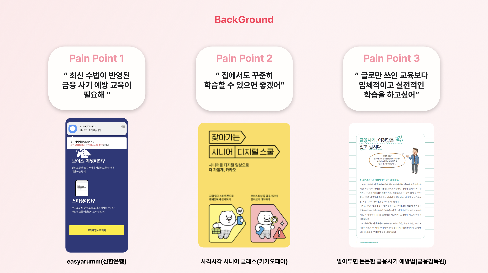
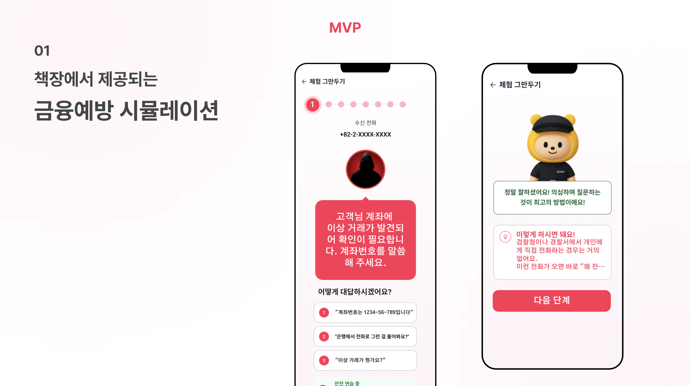
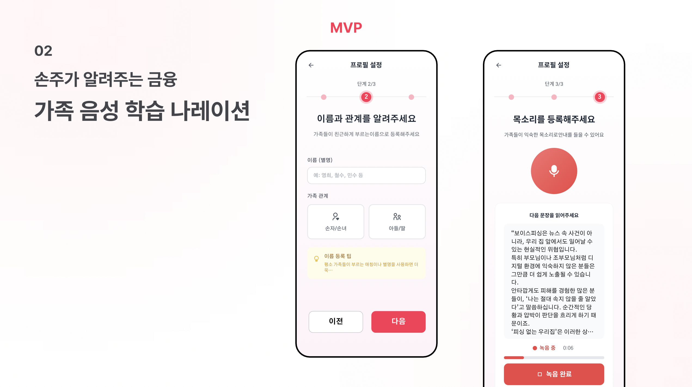
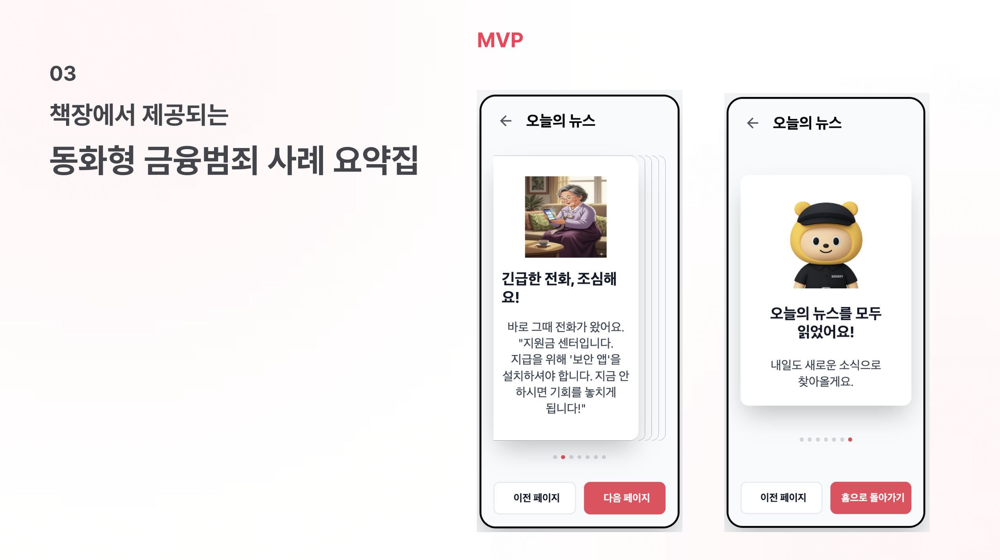
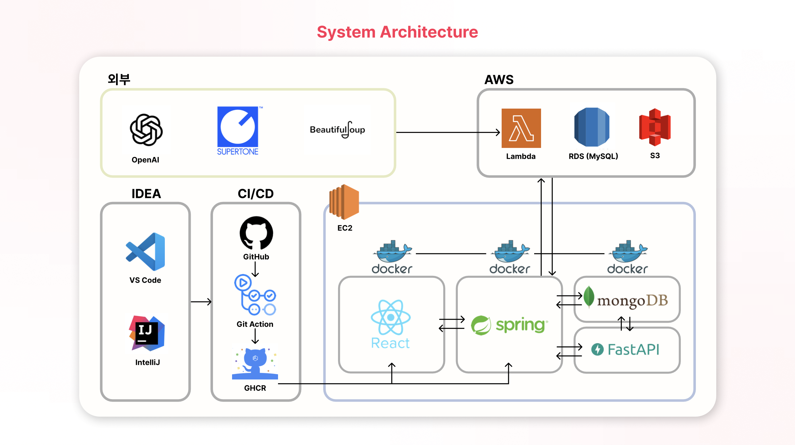

# 서비스 소개

## 주제 선정 배경

1. 기존 시뮬레이션 서비스는 **최신 사기 수법 반영이 미흡함**

2. 이동이 불편한 고령층에게 **장소 제약 없는 학습 환경 제공 필요**

3. 단순한 읽기 자료가 아닌, **참여형 체험 학습으로 효과 극대화**

## 핵심 기능

### 1. 최신 금융 사기 관련 뉴스 기반의 시나리오 시뮬레이션 제공

- **최신 뉴스 기사 크롤링** : `KoBART`를 활용하여 뉴스 기사 요약 후 VectorDB와의 유사도 비교

- **새로운 시나리오 분류 및 저장** : 설정한 유사도 기준보다 낮을 경우 새로운 시나리오로 분류 및 프롬프트 생성

### 2. 가족의 목소리 등록

- 가족 정보 등록 : 스크립트를 따라 읽으며 녹음하여 목소리를 등록

- 고유 링크 제공 : 등록된 목소리 정보가 담긴 고유의 링크 생성 및 제공

### 3. 등록한 목소리로 요약 뉴스 나레이션

- 등록된 목소리로 나레이션 제공 : 고유 링크로 접속하여 등록된 목소리로 요약 나레이션

## 시스템 아키텍처

## 기술 스택

### Frontend

